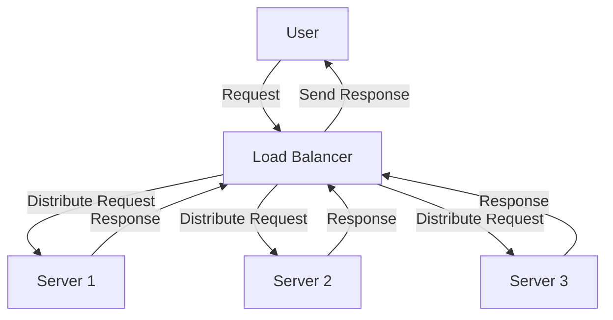
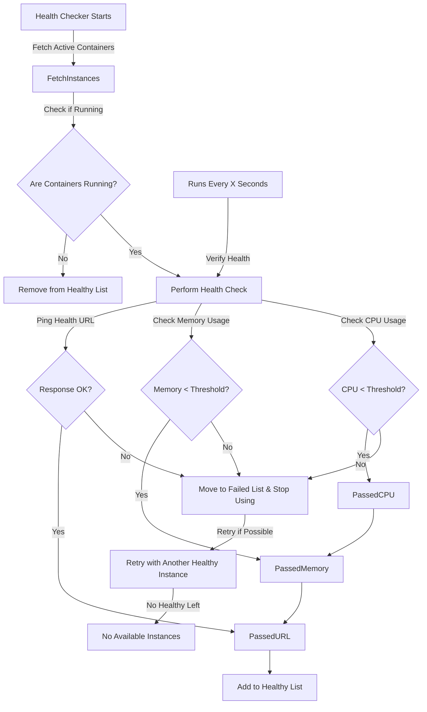

# **Round Robin Load Balancer API**

## 📌 **Goal**
The objective of this project is to implement a **Round Robin API** that distributes requests to multiple **Application API instances** in a **scalable and fault-tolerant** way.

**Key Features:**
- Implements **Round Robin API** to evenly distribute requests.
- Detects **Stopped or slow instances** and routes traffic accordingly.
- Provides how we can test the system.

---

## 🛠 **Planning & System Design**

### **Overall Workflow**

#### Core Flow



#
#### Health Checker Flow



---

## 🎯 **Design Patterns Used**
We applied the **Gang of Four (GoF)** design patterns to create a structured and maintainable system.

### **1️⃣ Creational Patterns**
- **Singleton Pattern** `HealthChecker` 
  - Ensures that only one health checker is responsible for monitoring all instances.

### **2️⃣ Structural Patterns**
- **Proxy Pattern** → `RoundRobinProxy`  
  - Acts as a proxy between users and backend application instances.

### **3️⃣ Behavioral Patterns**
- **Strategy Pattern** → `LoadBalancer`  
  - The Load Balancer uses different request distribution strategies.

## 📂 **Project Structure & File Descriptions**
| File / Directory | Description |
|-----------------|-------------|
| `round_robin/` | Contains core load balancing logic |
| `round_robin/proxy.py` | Implements the Round Robin algorithm |
| `round_robin/factory.py` | **Factory Pattern** for dynamic proxy creation |
| `monitoring/health_checker.py` | **Health Monitoring & Circuit Breaker** |
| `monitoring/system_monitor_docker.py` | Monitors **CPU & Memory** usage via Docker API |
| `adapters/docker_adapter.py` | **Adapter Pattern** for Docker communication |
| `instance_manager.py` | **Auto-detects running API instances** dynamically |
| `tests/` | Contains **unit & integration tests** |
| `locustfile.py` | **Performance testing** using Locust |
| `docker-compose.yml` | Defines **Docker containers** for easy scaling |

---

## 🛡 **Advanced Circuit Breaker in Health Checker**
We implement an **intelligent circuit breaker** in `health_checker.py` to handle **API failures** dynamically.

### 🚨 **Circuit Breaker Features**
✅ **Detects failures** (timeouts, errors, and crashes).  
✅ **Prevents overloading** failing instances.  
✅ **Automatically recovers** once an instance becomes healthy.  
 
### 🛡️ **Security & Attack Protection**
✅ **Attack Detection & Mitigation:** If an IP exceeds a suspicious request threshold, stricter throttling is applied.

✅ **Environment-Based Throttling** Default rate limits are set via environment variables.

---

## ✅ **How It Fulfills Requirements**
### **Handling API Failures**
- If an **application API goes down**, the health **removes it** from the available instances. Also if we get server errors we keep it in failed instance list for health check.
- The **HealthChecker** continuously monitors APIs and **re-adds them** if they recover.

### **Handling Slow APIs**
- If an instance starts responding **slowly**, the **HealthChecker** detects latency, CPU usage and Memory usage and if its bellow threshold we dont use that instance till its in good condition.

### **Testing Strategy**
We use **Django's unittest framework** and **Locust** for performance benchmarking.
- **Unit Tests:** Validate individual components.
- **Integration Tests:** Ensure smooth end-to-end communication.
- **Performance Tests:** Check system efficiency under high loads.(Using locust)

---

---

## 🚀 **How to Run the Project**
### **Step 1: Go to root**
```bash
cd django_round_robin/
```

### **Step 2: Build & Start Services**
```bash
docker-compose up --build
```
> This will start **3 application instances** and the **round robin proxy**.
  
### **Step 4: Run Performance Tests**
> Docker compose also handling the locust initialzation. Its completly automatic.

Then visit **http://localhost:8089** to configure & run tests.

---

## 📡 **API Endpoints**
### **Process Request (Forwarded via Load Balancer)**
```bash
curl --location 'http://localhost:8080/api/process/' \
--header 'Content-Type: application/json' \
--data '{
    "game": "Mobile Legends",
    "gamerID": "GYUTDTE",
    "points": 20
}'
```
✅ **Expected Response:**
```json
{
    "game": "Mobile Legends",
    "gamerID": "GYUTDTE",
    "points": 20
}
```

---

## **📝 Log Hours**


| Date       | Phase                  | Hours |
|------------|------------------------|-------|
| 2025-02-17 | **Investigation** – Research requirements, analyze constraints | 2.0 |
| 2025-02-17 | **Design** – Architect system, API health checker logics | 2.0 |
| 2025-02-18 | **Test** – Test cases for core logics and project structure building | 1.0 |
| 2025-02-18 | **Development** – Write minimal code to pass tests  | 1.0 |
| 2025-02-18 | **Refactoring** – Optimize code without breaking tests (TDD Step 3) | 1.0 |
| 2025-02-19 | **Testing and Development** – Develop health checker | 2.0 |
| 2025-02-19 | **Bug Fixing** – Fix issues from failed tests | .5 |
| 2025-02-20 | **Development** – Complete solution and final test cases | 2.0 |
| 2025-02-20 | **Bug Fixing** – Fix issues from failed tests | 2.5 |
| 2025-02-21 | **Documentation** – Update API docs, README, and test coverage | 2.0 |
| 2025-02-22 | **Final Testing & Optimization** – Run final checks, system tuning | 1.0 |
| 2025-02-22 | **Load testing and some minor fixes** – Final testing before submission | 2.0 |

### Total 14 Hours
 
---

